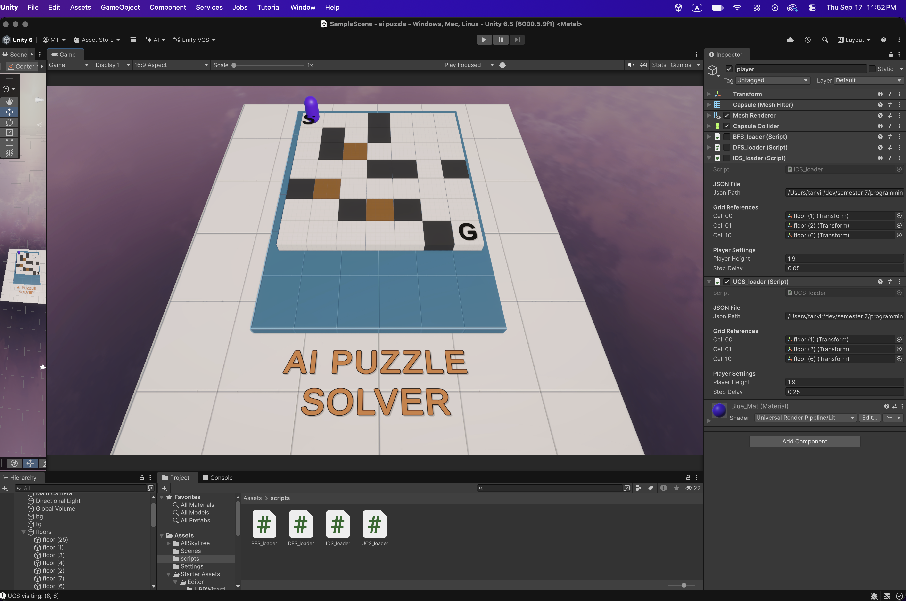

# AI Puzzle Solver

**A Unity maze visualizer powered by search algorithms written in Python.**

This university AI project explores how different uninformed search strategies navigate the same 7 × 7 maze. Python generates search results, and Unity animates a character visiting the corresponding cells.



> The screenshot is stored as `ss.png` in the repository root, alongside this README.

## Algorithms

| Algorithm | How it chooses the next node | What it demonstrates |
| --- | --- | --- |
| **Breadth-First Search (BFS)** | First-in, first-out queue | Explores by depth; finds a route with the fewest moves when all moves have equal cost. |
| **Depth-First Search (DFS)** | Last-in, first-out stack | Follows a branch deeply before exploring alternatives. |
| **Iterative Deepening Search (IDS)** | Repeated depth-limited DFS | Tries depth limits of 0, 1, 2, … until the goal is found. Earlier nodes may be explored repeatedly. |
| **Uniform-Cost Search (UCS)** | Priority queue ordered by accumulated cost | Expands the lowest-cost candidate first, accounting for different terrain costs. |

The UCS implementation uses Python's `heapq` and a `Node` class with `__lt__` operator overloading to compare accumulated costs.

## Maze rules

- **Start:** `(0, 0)`
- **Goal:** `(6, 6)`
- **Normal floor (`f`):** cost `1` to enter
- **Mud (`m`):** cost `5` to enter
- **Wall (`w`):** blocked
- **Movement:** up, down, left, and right (no diagonal movement)

Python represents traversable cells as `(row, column)` coordinates. For UCS, the graph also associates each reachable neighbor with the cost of entering that cell.

## How it works

```text
7 × 7 maze
    ↓
Python maze-to-graph conversion
    ↓
BFS / DFS / IDS / UCS
    ↓
JSON search results: { "row": ..., "col": ... }
    ↓
Unity C# loader
    ↓
Grid coordinates → Unity world positions
    ↓
Character visualizes the search
```

**Search order vs. solution route:** The current Unity visualization plays the *order in which nodes are explored*. The player may jump between nonadjacent cells; that does not mean the final route follows those jumps. IDS may also revisit earlier cells as its depth limit increases. UCS additionally computes the accumulated cost to reach the goal.

## Technologies

- **Unity 6** — 3D maze, character, and visualization
- **C#** — JSON loading and timed movement using coroutines
- **Python** — graph construction and search algorithms
- **`heapq`** — UCS priority queue
- **Newtonsoft JSON for Unity** — reads search results in C#

## Running the project

1. Clone the repository and open its Unity project folder in **Unity Hub**.
2. Run the Python search notebook/scripts to generate the corresponding JSON result files. These files must be accessible on your computer.
3. In Unity, select the player object and configure the loader's **JSON Path** to the actual location of the matching JSON file. Paths from another computer will not work unchanged.
4. Assign the grid reference transforms: **Cell 00** = `(0,0)`, **Cell 01** = `(0,1)`, and **Cell 10** = `(1,0)`.
5. Enable the loader for the algorithm you want to inspect and disable the other loaders if they use the same key.
6. Enter **Play** mode and press **Space** to start the visualization.

The C# loaders expect a named JSON array with `row` and `col` objects, for example:

```json
{
  "bfs_path": [
    { "row": 0, "col": 0 },
    { "row": 1, "col": 0 },
    { "row": 0, "col": 1 }
  ]
}
```

Use the matching key for the selected loader (`bfs_path`, `dfs_path`, `ids_path`, or `ucs_path`). Ensure the Python export and the C# JSON lookup use **exactly the same capitalization**.

> **Setup note:** The Python notebook/scripts or generated JSON files may need to be added to the repository separately if they currently live outside the Unity project folder. This README does not assume they have already been committed.

## Project status

The Unity project contains loaders for **BFS, DFS, IDS, and UCS**. The current focus is visualizing their different exploration behavior on the same maze, including UCS's terrain-aware cost handling.

